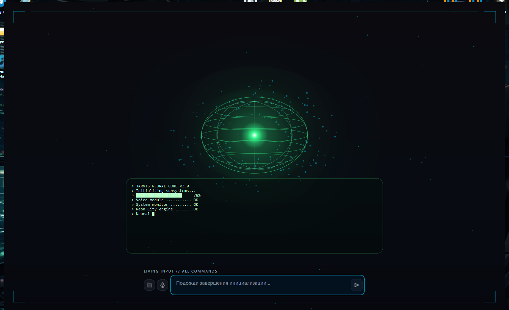
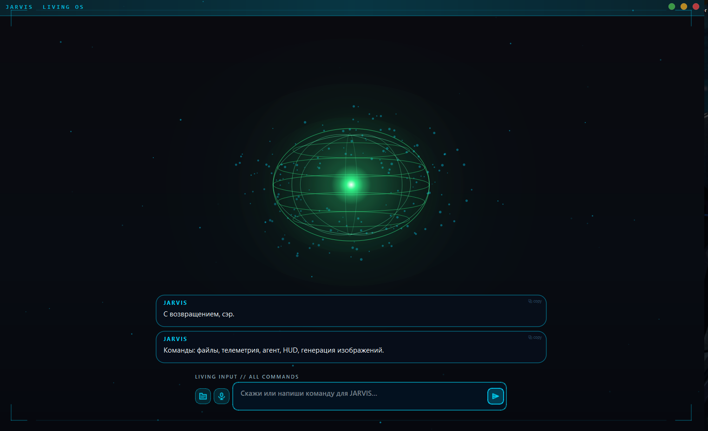
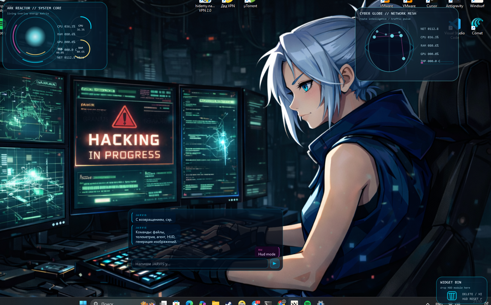
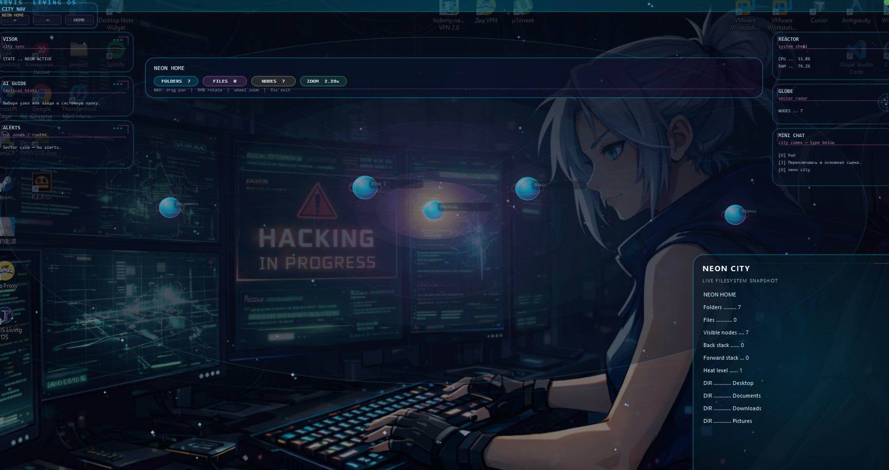
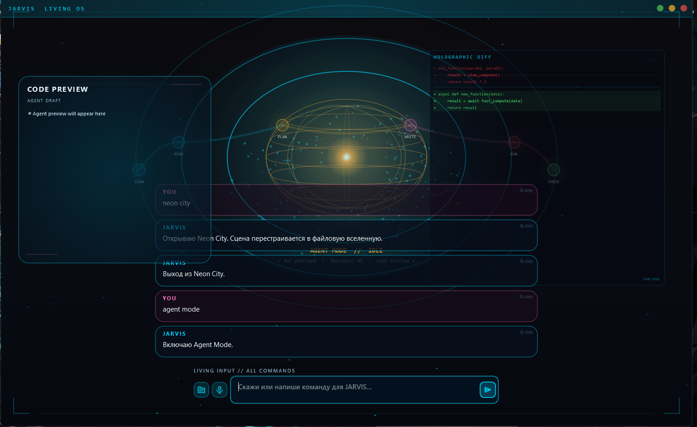
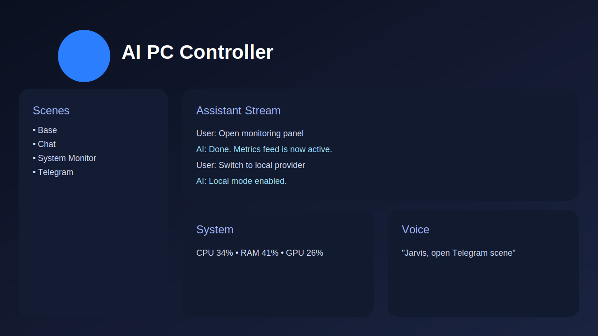
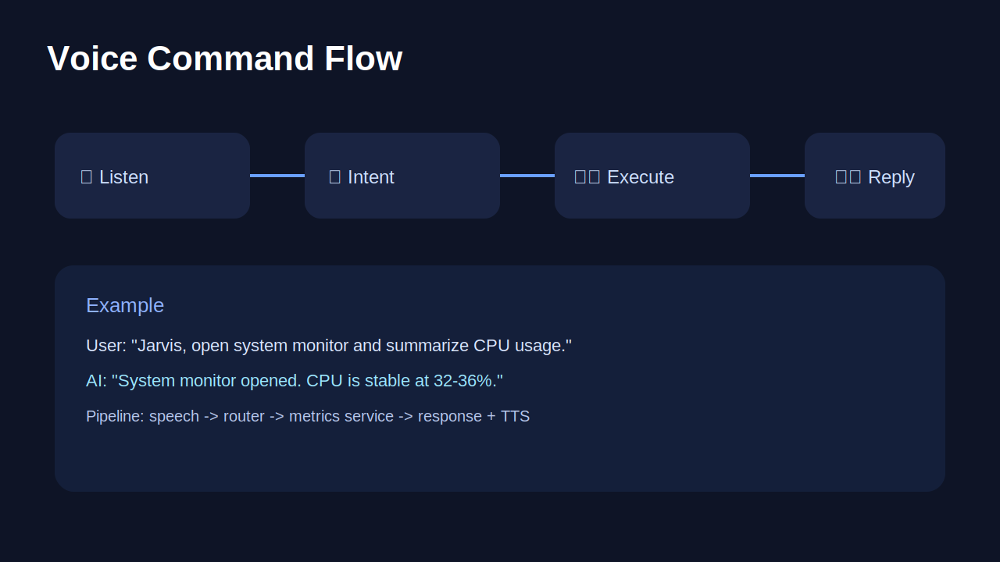
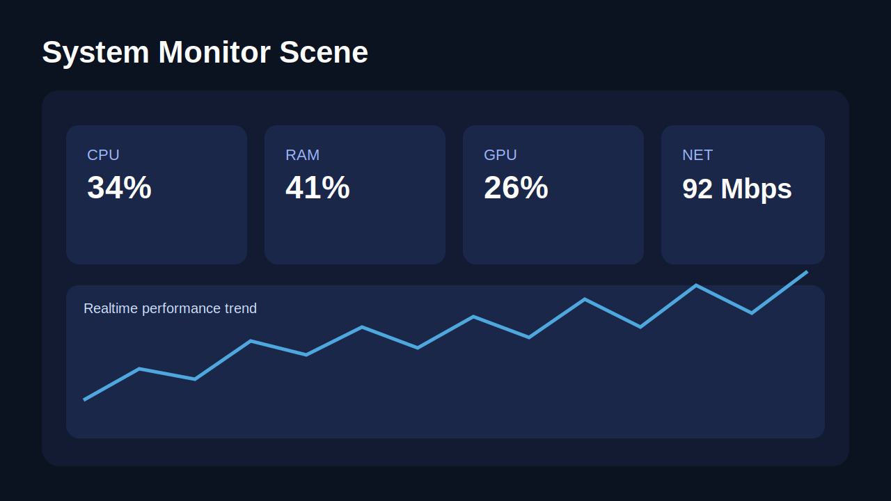
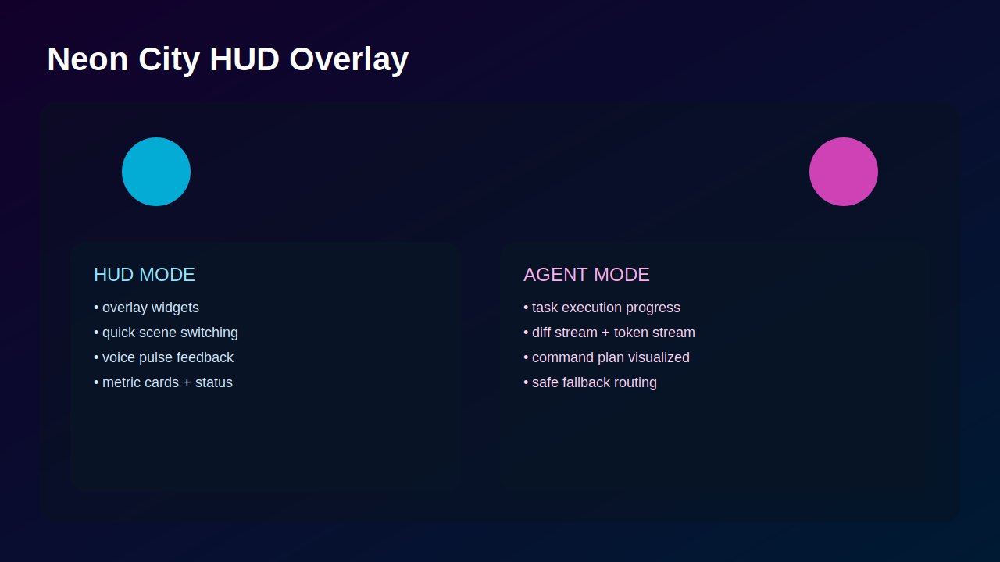
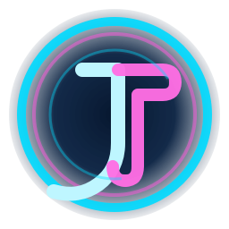

# 🤖 AI PC Controller — Portfolio Edition

A desktop AI assistant system focused on **voice-first control**, **OS automation**, and **modular AI routing**.

> Public portfolio version: architecture + visuals + engineering story.
> Full source code is intentionally private.

## ✨ What this project demonstrates

- 🎙️ Voice-driven assistant interactions
- 🧠 Multi-provider AI routing (local + cloud providers)
- 🖥️ OS control and command orchestration
- 🧩 Scene-based desktop UX architecture
- 🔌 Service-oriented modules (AI / TTS / Telegram / metrics)
- 🌆 **Neon City scene** with immersive visual mode
- 🧭 **HUD mode** with overlay widgets and live status
- 🤖 **Agent mode** with task progress and execution flow

## 🛠️ Tech Direction

- **Desktop:** Python + PyQt6
- **AI Layer:** local engine + pluggable provider services
- **Integrations:** Telegram (Telethon), TTS backends
- **Architecture:** modular service layer + command router + state engine

## 🖼️ Screenshots

### Real app screens

### Product visuals (mock)

### Branding

## 📦 Public Repository Contents

This repo includes only:

- High-level architecture and case study
- Product/engineering documentation
- Safe snippets and mock visuals

This repo does **not** include:

- Full source code
- Secret env values
- API keys or private infrastructure data

## 🤝 Recruiter / Team Review

Available on request:

- Private code walkthrough
- Deep architecture review
- Scaling and production hardening roadmap

---

### CV one-liner

Built a modular AI desktop assistant platform with voice-first UX, multi-provider AI routing, OS command orchestration, and integration-ready architecture (public portfolio version with private full source).
